# End-to-End DevOps Project: Flask E-Commerce Application on AWS EKS

## Project Overview

This project demonstrates a complete DevOps CI/CD pipeline for deploying a Flask-based E-Commerce application on Amazon EKS using Jenkins, Docker, Terraform, and Kubernetes.

The infrastructure is fully provisioned using Terraform, the application is containerized with Docker, the CI/CD pipeline is automated with Jenkins, and the application is deployed to Kubernetes running on AWS Elastic Kubernetes Service (EKS).

---

# Architecture

```
                  GitHub
                     │
                     ▼
                Jenkins Pipeline
                     │
       ┌─────────────┴─────────────┐
       │                           │
       ▼                           ▼
 Build Docker Image         Terraform Apply
       │                           │
       ▼                           ▼
 Docker Hub                 AWS Infrastructure
                                   │
                ┌──────────────────┴──────────────────┐
                │                                     │
                ▼                                     ▼
             Amazon VPC                          IAM Roles
                │
                ▼
           Amazon EKS Cluster
                │
                ▼
        Managed Node Group
                │
                ▼
      Kubernetes Deployment
                │
                ▼
      Kubernetes LoadBalancer
                │
                ▼
       Flask E-Commerce Website
```

---

# Technologies Used

- AWS
- Amazon EKS
- Amazon EC2
- Amazon VPC
- IAM
- Terraform
- Jenkins
- Docker
- Docker Hub
- Kubernetes
- kubectl
- Git
- GitHub
- Linux
- Bash
- Flask

---

# Project Structure

```
.
├── terraform/
│   ├── provider.tf
│   ├── versions.tf
│   ├── variables.tf
│   ├── terraform.tfvars
│   ├── vpc.tf
│   ├── subnets.tf
│   ├── internet_gateway.tf
│   ├── route_tables.tf
│   ├── security_groups.tf
│   ├── iam.tf
│   ├── eks.tf
│   ├── nodegroup.tf
│   ├── addons.tf
│   ├── outputs.tf
│   └── main.tf
│
├── kubernetes/
│   ├── deployment.yaml
│   └── service.yaml
│
├── Jenkinsfile
├── Dockerfile
└── README.md
```

---

# Infrastructure Provisioned

Terraform provisions the following AWS resources:

- VPC
- Public Subnets
- Private Subnets
- Internet Gateway
- NAT Gateway
- Route Tables
- Security Groups
- IAM Roles
- Amazon EKS Cluster
- Managed Node Group
- EKS Add-ons
  - VPC CNI
  - CoreDNS
  - kube-proxy

---

# Jenkins Pipeline

The CI/CD pipeline performs the following stages:

1. Clone GitHub Repository
2. Build Docker Image
3. Push Docker Image to Docker Hub
4. Update Kubernetes Deployment
5. Deploy to Amazon EKS

---

# Kubernetes Resources

- Deployment
- ReplicaSet
- Pods
- LoadBalancer Service

Application is deployed with **2 replicas**.

---

# Docker

Docker is used to:

- Build the Flask application image
- Push image to Docker Hub
- Pull image from Kubernetes

Example:

```bash
docker build -t flask-ecommerce .
docker tag flask-ecommerce vishwasgm29/flask-ecommerce:latest
docker push vishwasgm29/flask-ecommerce:latest
```

---

# Deployment

After deployment,

```bash
kubectl get pods
```

Output

```
READY   STATUS
1/1     Running
1/1     Running
```

Check Services

```bash
kubectl get svc
```

Output

```
TYPE           LoadBalancer
EXTERNAL-IP    <AWS Load Balancer DNS>
```

The application is accessible through the AWS Load Balancer.

---

# Screenshots

## Jenkins Pipeline
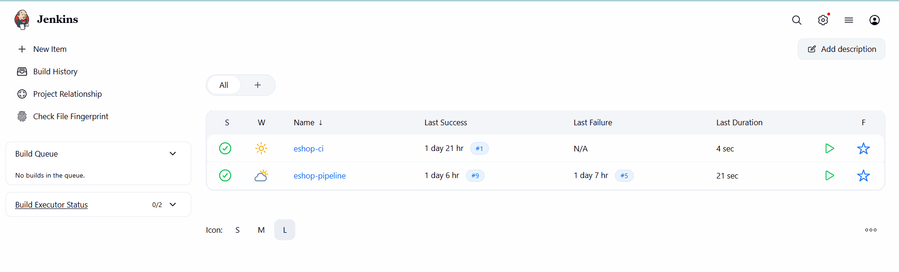


## Terraform 
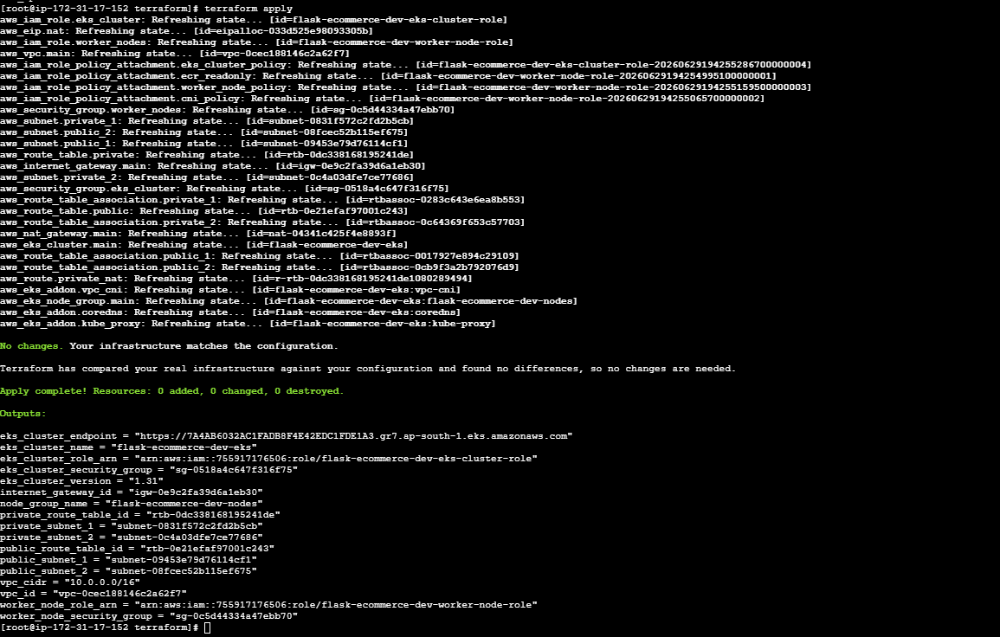
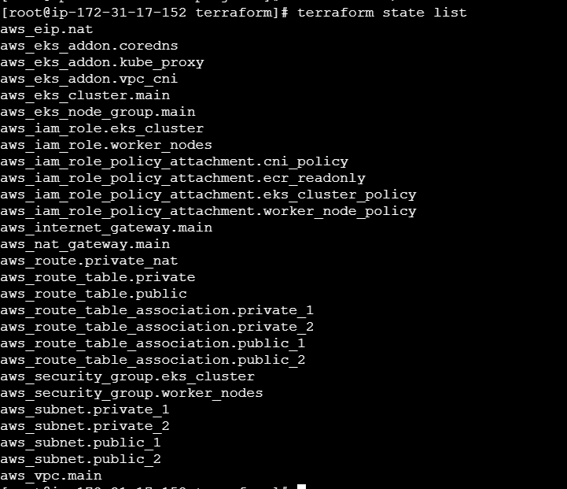
## Docker Images
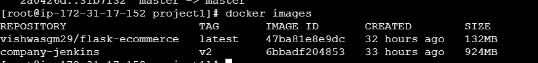
## AWS EKS Cluster
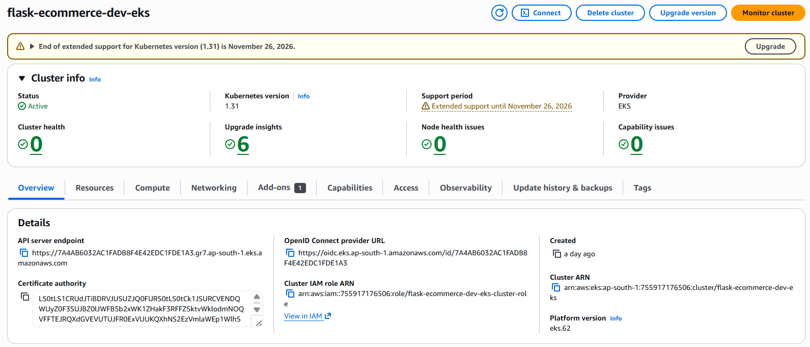
## AWS VPC
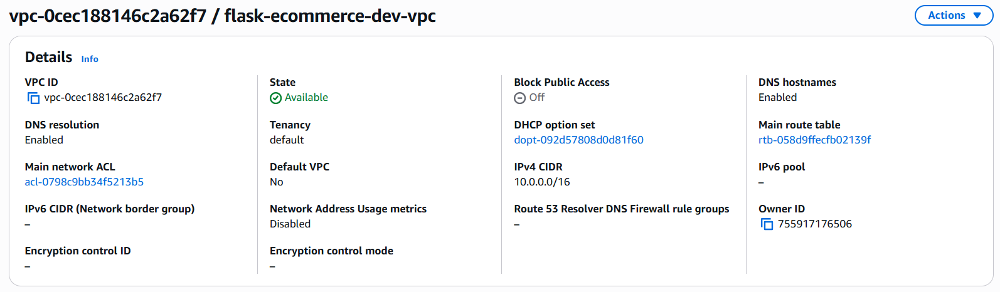
## AWS Load Balancer
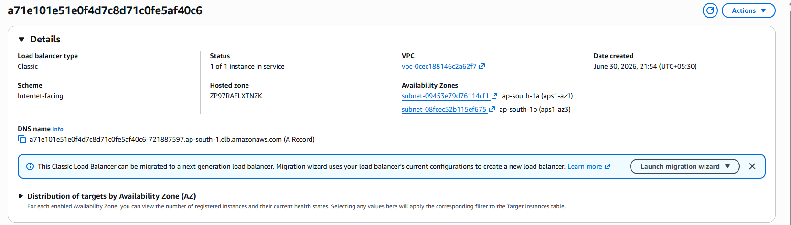
## AWS Subnet
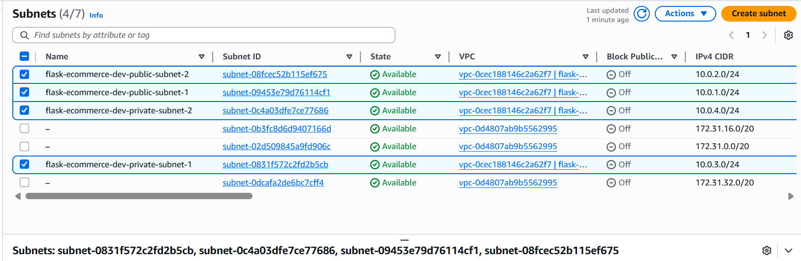
## AWS NAT Gateway
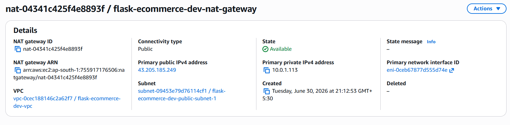
## kubectl nodes
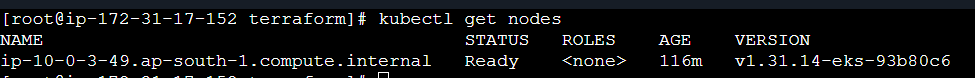
## kubectl pods
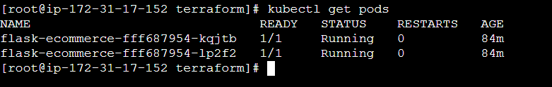
## kubectl services
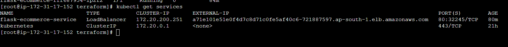
## Flask Application Running
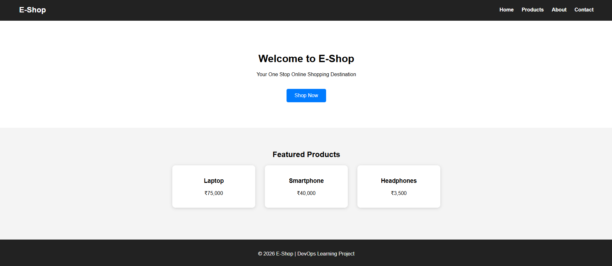

---

# Challenges Faced

During implementation, the following issues were encountered and resolved:

- EKS Node Group creation failure
- Invalid EC2 instance type
- AWS Region mismatch
- Missing NAT Gateway
- Private subnet routing issues
- Worker nodes failing to join cluster
- Terraform dependency management
- ImagePullBackOff
- Docker image tag mismatch
- Kubernetes deployment troubleshooting

---

# Key Learnings

- Infrastructure as Code using Terraform
- AWS Networking
- IAM Role Management
- Amazon EKS
- Kubernetes Deployments
- Kubernetes Services
- Docker Image Management
- Jenkins CI/CD
- Troubleshooting Kubernetes
- End-to-End DevOps Workflow

---

# Outcome

Successfully deployed a Flask E-Commerce application on Amazon EKS using a fully automated DevOps pipeline built with Jenkins, Docker, Terraform, and Kubernetes.

---

# Future Improvements

- Helm Charts
- ArgoCD
- Prometheus
- Grafana
- AWS CloudWatch
- Horizontal Pod Autoscaler
- HTTPS using ACM
- Route53 Custom Domain
- GitOps Workflow

---

# Author

**Vishwas Prabhu**

Cloud | Linux | AWS | Terraform | Docker | Kubernetes | Jenkins | DevOps Engineer

GitHub:
https://github.com/Vishwas97413

LinkedIn:
https://www.linkedin.com/in/vishwas-g-m-ab7997229/

---

# ⭐ If you found this project useful

Give this repository a ⭐ on GitHub.
